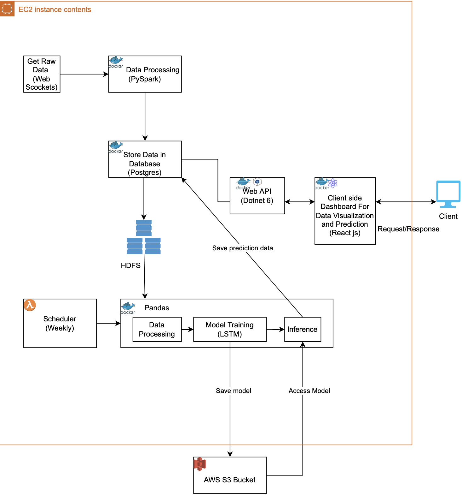

## Pyspark Cryptoanalysis and Prediction System

Analysis and prediction of Crypto data using Distributed Machine Learning

## Tools and Technology used:
- HDFS
- Pyspark
- AWS
- Postgres
- dot net 6
- Python
- React
- MUI and Apex charts

## High Level Architecture

## Authors
- [Padam Jung Thapa](mailto:padamjung.thapa@coyotes.usd.edu)
- [Pratyush Pradhan](mailto:pratyush.pradhan@coyotes.usd.edu)
- [Ronaj Pradhan](mailto:ronaj.pradhan@coyotes.usd.edu)
